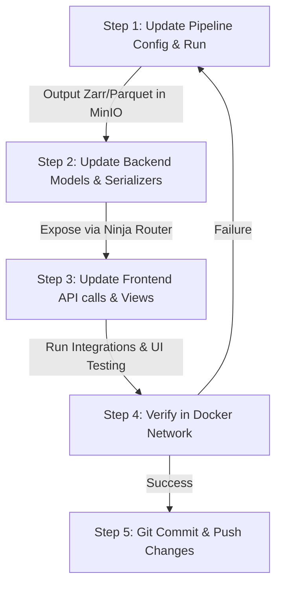

# FarmIntelytics Agent Playbook & Skills Directory

This playbook defines the modular skills, subagent directives, and execution workflows for building, testing, and integrating features across the FarmIntelytics platform (Data Pipeline, Django Backend, and React Frontend).

---

## 🗺️ 1. Workspace Architecture & Port Map

All services run inside a unified Docker network managed from the root `docker-compose.yml`:

| Service | Port (Host:Container) | Path in Workspace | Role |
| :--- | :--- | :--- | :--- |
| **frontend** | `5173:5173` | `./farmintelytics-webportal` | React + Vite UI portal |
| **backend-web** | `8000:8000` | `./farm_monitoring_backend` | Django + Django Ninja Rest API |
| **backend-db** | `5432:5432` | *(Docker image)* | PostGIS 16 (for Django DB) |
| **pipeline-db** | `5433:5432` | *(Docker image)* | PostGIS 13 (for Pipeline DB) |
| **redis** | `6379:6379` | *(Docker image)* | Celery broker & result store |
| **minio** | `9000` (API) / `9001` (UI) | *(Docker image)* | Local S3 replacement |

---

## 🛠️ 2. Core Agent Skills

Any agent or subagent working in this workspace must master and execute the following skills:

### ⚡ Skill A: Data Pipeline Orchestration
*   **Locating Configs**: Jobs are configured in `farmintelytics-data-pipeline/configs/` (e.g., `all_farms_batch_config.yaml`).
*   **Running Pipeline Jobs**:
    *   *Manual Run*: Run `python -m pipeline.run_pipeline --config configs/sample_config.yaml --page <page_name>` inside the pipeline environment.
    *   *Docker Run*: Run `docker compose run --rm pipeline-service --config configs/sample_config.yaml --page <page_name>`.
*   **Verifying Output**: Checks MinIO buckets at `http://localhost:9001` (user: `minioadmin`, pass: `minioadmin`) under the `farmintelytics-data/` bucket.
*   **No Synthetic Data Rules**: Ensure all tests utilize real spatial layers or local cached GeoTIFFs rather than mock generators.

### 🐍 Skill B: Backend API Development
*   **Exposing Endpoints**: Django Ninja routers are located in `farm_monitoring_backend/agromonitor/router.py` and `farm_monitoring_backend/monitoring/api.py`.
*   **Database Migrations**:
    *   If database models in `common/models.py`, `accounts/models.py`, or `monitoring/models.py` are updated, run:
        ```bash
        docker compose exec backend-web python manage.py makemigrations
        docker compose exec backend-web python manage.py migrate
        ```
*   **Running Backend Tests**:
    ```bash
    docker compose exec backend-web python manage.py test
    ```

### ⚛️ Skill C: Frontend Experience Building
*   **Adding Pages/Modules**: Pages are organized under `farmintelytics-webportal/src/apps/` and `src/modules/`.
*   **Integrating APIs**: Fetch data using the client base configuration in `src/services/agromonitorApi.js` which automatically loads `VITE_API_BASE_URL` from the `.env` configuration.
*   **Build & Lint Check**: Before concluding development, always check for syntax or TypeScript errors by running:
    ```bash
    npm run build
    npm run lint
    ```

---

## 🔄 3. Autopilot Integration Loop (Step-by-Step)

When implementing a new feature or adding monitoring capabilities for a new crop:



### Detailed Steps:
1.  **Orchestrate Pipeline**: Add necessary Sentinel/Landsat collections or climate bands to the pipeline configs. Execute the pipeline service, verifying files are output to MinIO.
2.  **Verify DB & Backend Schema**: If spatial metadata changes, apply PostGIS updates on the backend. Extend schemas in `monitoring/schemas.py`.
3.  **Construct Frontend Interface**: Connect React components to the newly created endpoints.
4.  **Full Service Verification**: Navigate to `http://localhost:5173` using a browser subagent (or direct verification) to ensure pages load without console errors and display correct analytics.
5.  **Git Commit & Sync**: Save changes with clear commit messages and push immediately to keep remote repositories in sync.
