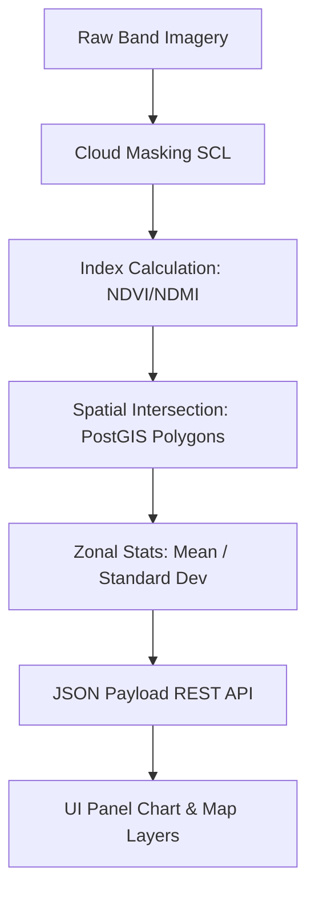

# AgroMonitor Spatial Analytics & Visualization Specification

This document provides a detailed specification of the analytical metrics, map layers, mathematical indices, visual thresholds, and chart analytics expected across all pages, subpages, and widgets of the AgroMonitor spatial web portal.

---

## 1. Core Analytics Framework & Zonal Statistics

AgroMonitor bridges remote sensing satellite imagery with localized field sensor telemetry. Data is analyzed across two distinct spatial scopes:
1.  **Plot-Level Analysis**: Localized vector boundaries (Polygons) matching individual farm divisions (e.g., Plot Alpha, Beta, Gamma).
2.  **Whole Farm Aggregate**: Spatial zonal statistic aggregation summing and averaging indicators across the entire estate boundaries.

### Zonal Statistics Extraction Workflow


---

## 2. Page & Subpage Specifications

### 2.1. Main Dashboard View
*   **Purpose**: Executive view of the estate's overall productivity, moisture, nutrient health, and land partition.
*   **Key Analytical Metrics (Summary Cards)**:
    *   *Total Area Under Monitoring*: Summarized HA (hectares).
    *   *Active Imagery Source*: Satellite platform (e.g., Sentinel-2 / Landsat-8).
    *   *Carbon Density Average*: Estimated mean carbon stock per hectare (tCO2e/HA).
    *   *Alert Count*: Total unresolved spatial anomalies.
*   **Chart Analytics**:
    1.  **Geospatial Vegetation Vigor Trends (Line Chart)**:
        *   *X-Axis*: Date / Satellite Pass.
        *   *Y-Axis*: Normalized Difference Vegetation Index (NDVI) [0.2 to 1.0].
        *   *Purpose*: Temporal trend comparison of average plot vigor.
    2.  **Moisture Retention Index (Bar Chart)**:
        *   *X-Axis*: Selected Plots.
        *   *Y-Axis*: Normalized Difference Moisture Index (NDMI) [0.0 to 0.8].
        *   *Purpose*: Spatial comparison of root-zone soil water retention.
    3.  **Nutrient Profiling (Radar Chart)**:
        *   *Radial Nodes*: Nitrogen (N), Phosphorus (P), Potassium (K), Organic Matter, Soil pH, Micro-Moisture.
        *   *Purpose*: Balanced nutrient density mapping against crop target baselines.
    4.  **Land Classification Area (Doughnut Chart)**:
        *   *Segments*: Cash Crop, Restoration Zone, Forest Buffer, Infrastructure.
        *   *Purpose*: Land use classification compliance auditing.

---

### 2.2. Map Analytics Portal (5 Spatial Pages)

Each map portal implements **Split-Screen Compare Mode** (Swipe Divider) utilizing Leaflet custom `<Pane>` wrappers clipped dynamically by `clipPath` parameters.

```
                    LEFT SIDE (Pane A)     |     RIGHT SIDE (Pane B)
                     Selected Date A       |      Selected Date B
                    [ Green Highlight ]    |     [ Blue Highlight ]
                                           |
                                           |
                                   [↔ Drag Handle ↔]
```

#### A. Intelligence Layers Composite
*   **Purpose**: Fused multi-band indexes to identify anomalous crop stress and verify voluntary carbon compliance.
*   **Map Layers**:
    *   *Crop Vegetation Index (CVI)*: High-contrast chlorophyll absorption.
    *   *Water Deficit Index (WDI)*: Combined thermal and optical moisture indicators.
    *   *Chlorophyll Absorption (CAR)*: Visualizing red-edge canopy absorption.
    *   *UAS Spatial Anomaly*: Drone-derived thermal overlays highlighting micro-stressed polygons.
*   **Zonal Indices Popups & Sidebar Charts**:
    *   *Indices Displayed*: CVI Vigor, WDI Deficit, CAR Chlorophyll, UAS Anomaly Score.
    *   *Chart*: 5-week historic NDVI trend line chart.

#### B. Crop Health Analytics
*   **Purpose**: Focused vegetative monitoring to support early-stage disease detection and nitrogen fertilization modeling.
*   **Map Layers**:
    *   *NDVI Layer*: Primary vegetation index.
    *   *Chlorophyll Index (RECI)*: Red-edge band ratio tracking leaf nitrogen.
    *   *Water stress*: Crop canopy water content tracking.
    *   *Pest Risk Overlay*: Modeled danger zones using temperature and humidity profiles.
*   **Visual Index Classification Legends (5 Classes)**:
    | Class | NDVI Value Range | Visual Color | Agronomic Interpretation |
    | :--- | :--- | :--- | :--- |
    | **Exceptional** | $> 0.80$ | Dark Green (`#14532D`) | Maximum canopy closure, optimal health |
    | **Optimal** | $0.70$ – $0.80$ | Leaf Green (`#16A34A`) | Healthy vegetative activity |
    | **Moderate** | $0.55$ – $0.70$ | Light Green (`#86EFAC`) | Moderate canopy density, minor stress |
    | **Transition** | $0.45$ – $0.55$ | Amber (`#EAB308`) | Early stress anomaly, cover-crop transition |
    | **Deficit** | $\le 0.45$ | Red (`#EF4444`) | Severe canopy stress, bare soil, or crop loss |
*   **Zonal Sidebar Charts**:
    *   *Indices Displayed*: NDVI, Chlorophyll (RECI), Canopy Water Content, Pest Anomaly Score.
    *   *Chart*: 5-week health index line chart tracking selected metric trends.

#### C. Crop Yield Forecasting
*   **Purpose**: Predictive modeling of harvest dates, total seasonal yields, and crop growth stages.
*   **Map Layers**:
    *   *Estimated Yield Rate (t/HA)*: Projected harvest tonnage per hectare.
    *   *Dry Biomass Accumulation (kg/m²)*: Cumulative carbon capture in canopy structure.
    *   *Canopy Harvest Readiness (%)*: Crop maturity score calculated from historic thermal time integration.
    *   *Growth Stage Mapping*: Categorical representation (Emergence, Vegetative, Flowering, Maturity).
*   **Zonal Yield Classification Legends (5 Classes)**:
    | Class | Yield Rate (t/HA) | Visual Color | Status |
    | :--- | :--- | :--- | :--- |
    | **Exceptional** | $> 18.0$ | Dark Green (`#15803d`) | Optimal soil conditions & solar conversion |
    | **Good** | $12.0$ – $18.0$ | Green (`#22c55e`) | Consistent growth trajectory |
    | **Fair** | $8.0$ – $12.0$ | Yellow (`#eab308`) | Minor soil or moisture constraint |
    | **Suboptimal** | $4.0$ – $8.0$ | Orange (`#f97316`) | Stress during flowering stage |
    | **Failed / Bare** | $< 4.0$ | Red (`#ef4444`) | Critical lodging or pest destruction |
*   **Zonal Sidebar Charts**:
    *   *Indices Displayed*: Est. Yield Rate, Projected Yield, confidence accuracy, readiness %, biomass index.
    *   *Chart*: 5-week yield prediction line chart.

#### D. Climate & Sensor Telemetry
*   **Purpose**: Ground-truth weather monitoring coupled with satellite-derived surface temperature.
*   **Map Layers**:
    *   *Cumulative Rainfall (mm)*: Interpolated precipitation grids.
    *   *Soil Temperature (°C)*: Microclimate soil probe readings at 10cm depth.
    *   *Land Surface Temperature (LST)*: Satellite thermal band inversion.
    *   *Vapor Pressure Deficit (VPD)*: Direct indicator of transpiration stress.
*   **Soil Canopy Moisture Classification Legends (5 Classes)**:
    | Class | NDMI Value Range | Visual Color | Agronomic Interpretation |
    | :--- | :--- | :--- | :--- |
    | **Waterlogged** | $> 0.50$ | Royal Blue (`#1E3A8A`) | Soil saturation, pooling risk |
    | **Adequate** | $0.42$ – $0.50$ | Blue (`#2563EB`) | Optimal root zone transpiration |
    | **Moderate** | $0.35$ – $0.42$ | Light Blue (`#60A5FA`) | Under control, steady evaporation |
    | **Mild Stress** | $0.28$ – $0.35$ | Orange (`#F59E0B`) | Evaporative deficit, beginning irrigation need |
    | **Severe Stress** | $\le 0.28$ | Red (`#DC2626`) | Plant wilting, stomatal closure |
*   **Zonal Sidebar Charts**:
    *   *Indices Displayed*: Rainfall (mm), Soil Temp (°C), Surface Temp/LST (°C), VPD (kPa).
    *   *Chart*: 5-week microclimate sensor trend line chart.

#### E. Land Restoration & Agroforestry
*   **Purpose**: Verification of tree survival, biomass growth, and voluntary carbon offsets (VCS/Gold Standard).
*   **Map Layers**:
    *   *Canopy Regrowth Progress (%)*: Density increase compared to baseline.
    *   *Tree Survival Rate (%)*: Ratio of living saplings per hectare.
    *   *Estimated Carbon Offsets (tCO2e)*: Zonal carbon sequestration aggregates.
    *   *Biodiversity Density Index*: Tree species variation mapping.
*   **Zonal Sidebar Charts**:
    *   *Indices Displayed*: Canopy Progress, Survival Rate, Carbon Offset, Biodiversity score, Manager.
    *   *Chart*: 5-week reforestation progress trend line chart.

---

### 2.3. Verification Portal
*   **Purpose**: Technical MRV audit checklist to verify environmental compliance for carbon credit registries.
*   **Analytical Verification Checklists**:
    1.  **Boundary Integrity Audit**: Geospatial overlap query confirming that the plot coordinates match local land registry files with zero boundary collision.
    2.  **EUDR Deforestation Compliance Scan**: Temporal change detection using NIR bands, checking for canopy losses within monitored forest boundaries since the regulatory cutoff date (December 2020).
    3.  **Photosynthetic Active Cover Target**: Verifies that the plot maintains a minimum of 60% green canopy coverage (NDVI > 0.50) throughout the cropping season.
    4.  **Canopy Regrowth Progression**: Evaluates whether active restoration zones meet the baseline annual growth target (minimum +10% annual tree cover improvement).
*   **Telemetry Log Ledger**: Real-time console recording execution metadata (Sentinel-2 API connections, Planet RTT checks, local cache tiles, and validation status).

---

### 2.4. Certificate & Reports Tab
*   **Purpose**: Generates dynamic spatial compliance certificates for agricultural auditing.
*   **Inputs**:
    *   *Report Scope*: Select **Whole Farm (Aggregate)** or individual plots (Plot Alpha, Beta, Gamma).
    *   *Analytical Metric*: NDVI, NDMI, NDWI, SOC (Soil Organic Carbon), AGB (Aboveground Biomass).
*   **Dynamic Document Outputs**:
    *   Unique certificate hash and generation timestamp.
    *   *Whole Farm Aggregate Chart (Bar Chart)*: Comparison of selected metrics across all individual plots.
    *   *Plot-Level Chart (Line Chart)*: 5-week temporal historical trends.
    *   *AI Spatial MRV Diagnostic Summary*: Automatic insights outlining anomalies, compliance, and recommendations.

---

## 3. Mathematical Reference Guide (Core Satellite Indices)

The following formulas are evaluated inside the backend spatial processing pipeline to compute indices displayed on the map and charts:

$$NDVI = \frac{B_{NIR} - B_{Red}}{B_{NIR} + B_{Red}}$$

$$NDMI = \frac{B_{NIR} - B_{SWIR1}}{B_{NIR} + B_{SWIR1}}$$

$$EVI = 2.5 \times \frac{B_{NIR} - B_{Red}}{B_{NIR} + 6 \times B_{Red} - 7.5 \times B_{Blue} + 1}$$

$$LSWI = \frac{B_{NIR} - B_{SWIR2}}{B_{NIR} + B_{SWIR2}}$$
