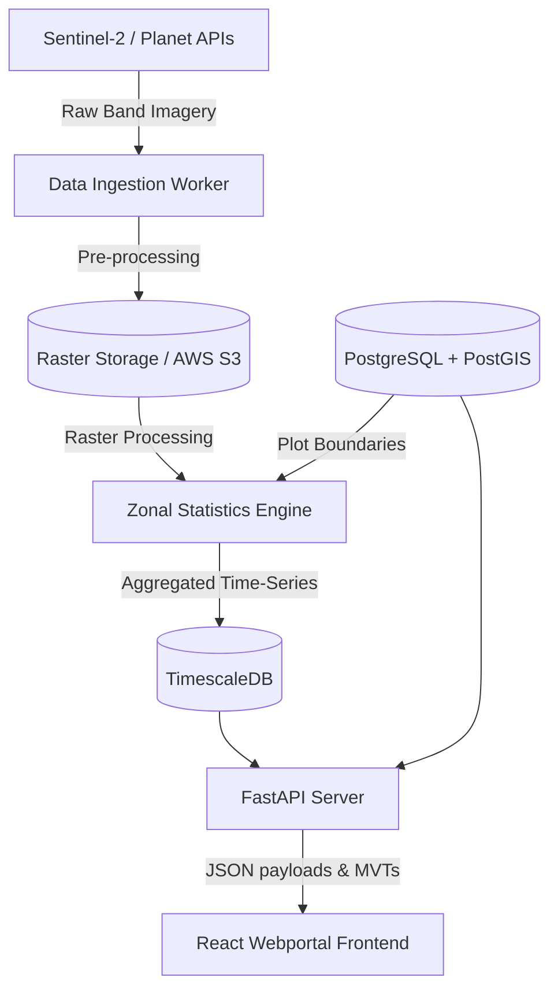

# Farmintelytics Spatial Web Portal: Backend Design & Specifications

This specification details the frontend expectations for all pages/subpages of the AgroMonitor module and outlines the technical architecture, data structures, and GIS pipeline requirements for the backend development.

---

## 1. Page-by-Page Requirements & Data Payload Specifications

### 1.1. Intelligence Layers (Geospatial Composite)
*   **Purpose**: Aggregated view of plot vigor, water index, and forest compliance to support MRV certification.
*   **Expected Frontend UI Elements**:
    *   Plot selector (Plot Alpha, Beta, Gamma) and Estate filters.
    *   Layer controls: Crop Vigor (CVI), Water Deficit (WDI), Chlorophyll (CAR), and Drone/UAS anomalies.
    *   MRV Spatial Certificate generator block.
*   **Data Models & API Payloads**:
    *   `GET /api/plots/intelligence`: Returns plot polygons, estate grouping, and current composite indices.
    ```json
    {
      "plot_id": "PLOT-ALPHA",
      "name": "West Valley Plot",
      "estate": "West Valley Estate",
      "boundary": {
        "type": "Polygon",
        "coordinates": [[[7.145, 3.355], [7.150, 3.355], [7.150, 3.360], [7.145, 3.360], [7.145, 3.355]]]
      },
      "indices": {
        "ndvi": 0.78,
        "ndmi": 0.42,
        "chlorophyll": 0.70,
        "uas_anomaly_score": 0.15
      }
    }
    ```

### 1.2. Crop Health Analytics
*   **Purpose**: Time-series health audits, vegetative stress flagging, and pest risk modeling.
*   **Expected Frontend UI Elements**:
    *   Raster index options: NDVI, Chlorophyll index, Leaf Water stress, and Pest Risk levels.
    *   Interactive popups with classification ranges (5 classes: Exceptional, Optimal, Moderate, Transition, Deficit).
*   **Data Models & API Payloads**:
    *   `GET /api/plots/health?date={date}`: Returns zonal stats for vegetative health indices.
    ```json
    {
      "plot_id": "PLOT-BETA",
      "indices": {
        "ndvi": 0.48,
        "chlorophyll": 0.43,
        "water_stress": 0.28,
        "pest_risk": "High Risk"
      }
    }
    ```

### 1.3. Crop Yield Forecasting
*   **Purpose**: Machine learning-based harvest forecasting, readiness scores, and dry biomass estimates.
*   **Expected Frontend UI Elements**:
    *   Interactive maps colored by yield rate (t/HA), canopy readiness, and dry biomass (kg/m²).
    *   Forecasting accuracy percentages (e.g., 95.4% Confidence).
*   **Data Models & API Payloads**:
    *   `GET /api/plots/yield/forecast?date={date}`:
    ```json
    {
      "plot_id": "PLOT-ALPHA",
      "yield_rate_ton_ha": 20.8,
      "projected_yield_tons": 260.0,
      "biomass_index": 2.45,
      "harvest_readiness_pct": 92,
      "confidence_accuracy": "95.4%"
    }
    ```

### 1.4. Land Restoration & Agroforestry
*   **Purpose**: Tracking carbon offset programs, canopy regrowth, survival counts, and biodiversity density.
*   **Expected Frontend UI Elements**:
    *   Restoration zones (Zone Alpha, Beta, Gamma) representing Reforestation, Species Diversification, and Riparian Buffer.
    *   Key performance indicators: Canopy Progress %, Tree Survival Count, Carbon Offset (tCO2e), and Biodiversity Index.
*   **Data Models & API Payloads**:
    *   `GET /api/restoration/zones`:
    ```json
    {
      "zone_id": "ZONE-ALPHA",
      "name": "Canopy Reforestation",
      "project_type": "Canopy Density",
      "progress_pct": 88,
      "survival_rate_pct": 94,
      "tree_count": 1200,
      "carbon_offset_tco2e": 45.2,
      "biodiversity_score": "92%",
      "manager": "John Musa"
    }
    ```

### 1.5. Climate & Sensor Telemetry
*   **Purpose**: Real-time integration of microclimate sensors, soil probes, and weather station models.
*   **Expected Frontend UI Elements**:
    *   Zonal layers for Cumulative Rainfall (mm), Soil Temperature (°C), Land Surface Temperature (LST), and Vapor Pressure Deficit (VPD).
*   **Data Models & API Payloads**:
    *   `GET /api/plots/telemetry?date={date}`:
    ```json
    {
      "plot_id": "PLOT-BETA",
      "rainfall_mm": 19.5,
      "soil_temp_celsius": 26.8,
      "surface_lst_celsius": 31.2,
      "vpd_kpa": 2.3
    }
    ```

---

## 2. Technical Decisions & Backend System Architecture



### 2.1. Geospatial & Database Engine
*   **Primary Database**: **PostgreSQL** with the **PostGIS** extension.
    *   *Decision rationale*: PostGIS is the industry standard for vector-based spatial operations. It permits native queries (e.g., `ST_Contains`, `ST_Area`, and `ST_Intersection`) to match plots against cadastral grids, verify boundaries, and prevent overlaps.
*   **Time-Series Storage**: **TimescaleDB** (PostgreSQL extension).
    *   *Decision rationale*: Ideal for indexing high-frequency telemetry (soil sensors, weather station pings, and satellite pass historic metrics) grouped by timestamps and plot IDs.

### 2.2. Satellite Imagery & GIS Processing Pipeline
*   **Data Sources**:
    *   **Sentinel-2 L2A (ESA)**: Multi-spectral, 10m spatial resolution, 5-day return period. Primary bands utilized: B4 (Red), B8 (NIR), B11 (SWIR).
    *   **Planet Labs PlanetScope (Commercial)**: 3m spatial resolution daily orbits, used for high-fidelity crop auditing and logging alerts.
*   **Image Processing Pipeline**:
    *   **Cloud Masking**: Apply SCL (Scene Classification Layer) masks to filter out clouds and shadows before index calculation.
    *   **Index Calculations**:
        *   $NDVI = \frac{NIR - Red}{NIR + Red} = \frac{B8 - B4}{B8 + B4}$
        *   $NDMI / LSWI = \frac{NIR - SWIR}{NIR + SWIR} = \frac{B8 - B11}{B8 + B11}$
    *   **Aggregation (Zonal Statistics)**: Use Python's `rasterstats` or `GDAL` libraries inside a celery worker task to calculate mean index values within the boundaries of each PostGIS plot polygon whenever a new satellite scene is ingested.

### 2.3. Vector Tile Layer Serving (MVT)
*   Instead of loading heavy GeoJSON layers directly onto React-Leaflet, the backend will slice vector boundaries into Mapbox Vector Tiles (MVT) dynamically using PostgreSQL's `ST_AsMVT` or pre-sliced cached layers via `pg_tileserv`.
*   *Performance gain*: Reductions in bundle transfers, rendering large geometries dynamically under 100ms.

### 2.4. API Endpoint Architecture (FastAPI + JWT Authentication)
*   **Framework**: **FastAPI** (Python).
    *   *Decision rationale*: Offers native async execution, automatic OpenAPI generation, and seamless integration with GIS packages (`Shapely`, `Fiona`, `GeoPandas`).
*   **Caching Strategy**: **Redis Cache**.
    *   *Zonal stats caching*: Zonal values for historic dates are immutable once computed. Cached in Redis indefinitely, bypassing database calls for all historic timelines.

---

## 3. Git Version Control Step-by-Step Commit Strategy

To maintain a clean version history and clear rollbacks, the split-screen comparison swipe mode was structured across seven logical commits:

1.  **`feat: add split comparison mode state variables`**
    *   *Scope*: Initialize `isCompareMode`, `compareTimelineIndex`, `activeDateSlot`, `splitPosition`, and `isDraggingSplit` in [AgroMonitor.jsx](file:///c:/Users/Admin/Desktop/ongoing_tasks/farmintelytics/webportal/src/apps/custom/AgroMonitor.jsx).
2.  **`feat: implement window event listeners for vertical swipe divider dragging`**
    *   *Scope*: Attach global mouse and touch move/end handlers inside the React `useEffect` hook to calculate pointer offset relative to map wrappers.
3.  **`feat: upgrade Calendar bottom panel UI with slot selectors`**
    *   *Scope*: Render compare mode toggle, Date A/B active slot toggles, and dual calendar day selection highlights with diagonal linear gradients.
4.  **`feat: integrate split-pane clipping on Intelligence Layers map`**
    *   *Scope*: Import React-Leaflet `<Pane>` controls and apply dynamic `clipPath` styling to split Date A/B polygon layers in the `intelligence-layers` tab.
5.  **`feat: integrate split-pane clipping on Crop Health and Crop Yield maps`**
    *   *Scope*: Add conditional `<Pane>` container clipping logic on the secondary maps to compare NDVI, readiness, and biomass overlays.
6.  **`feat: integrate split-pane clipping on Restoration and Climate maps`**
    *   *Scope*: Apply split clip-paths to the Land Restoration zones and Climate micro-telemetry vector overlays.
7.  **`docs: add backend specifications and database design specification`**
    *   *Scope*: Create `backend_design_spec.md` to define API payloads, PostGIS/TimescaleDB designs, and processing flows.
