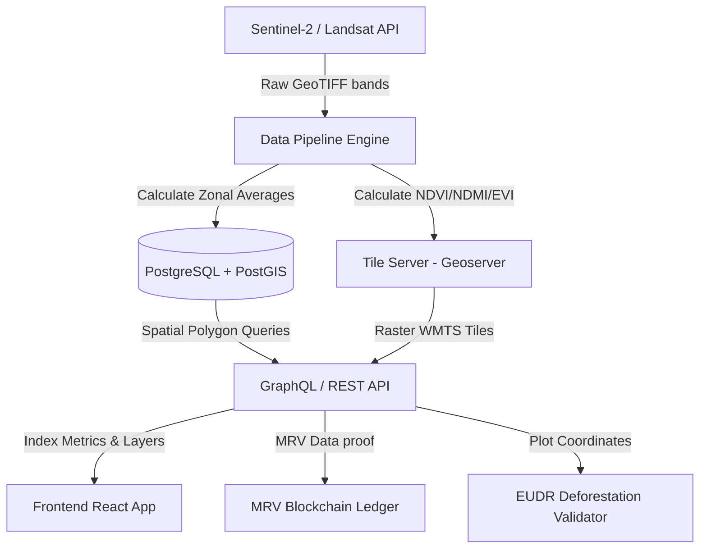

# Backend Architecture & Technical Decisions

This document details the expected page-by-page data specifications and the critical backend architectural decisions required to support the Farmintelytics enterprise satellite monitoring and sustainability platform.

---

## 1. Page-by-Page Data Specifications

To ensure the frontend portal operates seamlessly, the backend must expose APIs delivering structured geospatial, temporal, and diagnostic datasets.

### 1.1 Dashboard (Agro Analytics)
*   **Expected UI Elements**: 
    *   KPI cards (Total Layers, Active Users, Projects, Active Alerts).
    *   Vigor/Health Trends (NDVI line chart over 6 months).
    *   Moisture Retention (NDMI bar chart comparing active plots).
    *   Nutrient Profiling (Radar chart for GCVI, NDRE, NDWI, EVI, Soil Temp, Canopy Cover).
    *   Land Classification (Doughnut chart for crop block vs. conservation zones).
*   **Backend Requirements**:
    *   Aggregated weekly spatial indices (NDVI/NDMI averages) grouped by plot.
    *   Daily system logging status (active spatial auditors, system alerts tally).
    *   Multi-band soil profiling aggregates derived from Sentinel-2 SWIR/RedEdge bands.

### 1.2 Intelligence Layers
*   **Expected UI Elements**:
    *   Biophysical overlays: EVI (Crop biomass density), LSWI (Canopy water status), VHI (Stress composite), Planting Suitability (optimal cultivation zones).
    *   Plot-specific info panel: showing temporal index line chart, CVI Vigor index, WDI deficit, CAR Chlorophyll, and UAS anomaly scores.
*   **Backend Requirements**:
    *   Map Server generating WMTS (Web Map Tile Service) tiles for index layers.
    *   Zonal statistics API: computes mean, median, standard deviation, and anomaly scores for arbitrary polygon coordinate bounds.

### 1.3 Crop Health
*   **Expected UI Elements**:
    *   Interactive polygon map coloring blocks by index: NDVI (Vegetation Vigor), Chlorophyll (VCI), Water Stress (NDMI), Pest Risk.
    *   Block health ledger displaying: NDVI value, Chlorophyll value, Water stress index, Pest vulnerability rating (Low, Moderate, High), and boundary shape coordinates.
*   **Backend Requirements**:
    *   Pest risk classifier: ML model analyzing canopy density (NDVI) + humidity (NDMI) + local weather patterns to flag borer/locust migration risk.
    *   Time-series satellite index extractor.

### 1.4 Crop Yield
*   **Expected UI Elements**:
    *   Overlays for Estimated Yield, Biomass Output, Harvest Readiness, and Growth Index.
    *   Yield ledger: Estimated Yield Rate (t/HA), Projected Season Output (Tonnes), Prediction Accuracy (%), Readiness (%), and Yield Status.
*   **Backend Requirements**:
    *   Yield prediction engine: regression model analyzing cumulative NDVI integration + historical harvest yields + GCM meteorological projections.
    *   Harvest readiness analyzer: tracking chlorophyll drop-off rates indicating crop dry-down curves.

### 1.5 Climate
*   **Expected UI Elements**:
    *   Map layers: Rainfall (CHIRPS precipitation), Soil Temperature, Land Surface Temp (LST), Vapor Pressure Deficit (VPD).
    *   Ledger: Rainfall history (mm), Soil temperature (°C), LST (°C), and VPD (kPa).
*   **Backend Requirements**:
    *   Precipitation data parser: fetching CHIRPS daily rainfall datasets and calculating localized anomalies.
    *   MODIS LST parser: retrieving daily land surface temperature values and calculating VPD using temperature + relative humidity.

### 1.6 Land Restoration
*   **Expected UI Elements**:
    *   Restoration map showing zones (Canopy Reforestation, Native Species Agroforestry, Riparian Buffer).
    *   Restoration parameters: Canopy density progress (%), seedling survival rate (%), carbon offset sequestered (tCO2e), and biodiversity index (%).
*   **Backend Requirements**:
    *   Canopy density growth rate tracker: comparing current canopy cover against baseline forest cover in 2020.
    *   Carbon sequestration model: calculating accumulated Aboveground Biomass (AGB) using EVI and canopy cover coefficients.

### 1.7 Alerts Command Center
*   **Expected UI Elements**:
    *   KPIs: Total Incidents, Critical alerts, Warnings, Acknowledged items.
    *   Interactive feed: Real-time incident logs by plot (Moisture deficit warnings, pest warnings, canopy loss events) with "Acknowledge" button.
*   **Backend Requirements**:
    *   Alert dispatcher: event-driven cron job running daily following satellite pass updates, checking for threshold breaches (e.g., NDVI < 0.50, LSWI < 0.30).
    *   State manager API: supporting acknowledgment writes, recording user details, timestamp, and response actions.

### 1.8 Verification Tab
*   **Expected UI Elements**:
    *   Verification stepper: Boundary Integrity Check, Deforestation Compliance Check, Canopy Density Standard, Soil Water Index Target.
    *   VCS/Gold Standard overlapping registries compliance panel.
    *   EUDR deforestation-free verification trace list.
*   **Backend Requirements**:
    *   Boundary mismatch engine: verifying cadastral polygons against registry coordinates to flag overlapping boundaries.
    *   EUDR Deforestation Compliance pipeline.

### 1.9 Reports Tab
*   **Expected UI Elements**:
    *   Analytical Metric (NDVI, NDMI, NDWI, SOC, AGB) & Report Scope (Whole Farm vs. individual plots) selector.
    *   Interactive PDF Certificate preview including trend/comparative charts and automated agronomic diagnostics summary text.
    *   Showcase of pre-compiled thematic environmental reports.
*   **Backend Requirements**:
    *   PDF rendering service: server-side generation of verified certificates including digital sign-off signatures and cryptographic hashes.
    *   Agronomic diagnostic generator: LLM-powered summary synthesizing index trends.

### 1.10 AI Assistant
*   **Expected UI Elements**:
    *   Thematic prompt scenario buttons (Climate-Smart Agriculture, Land Restoration, Carbon Registry, Traceability).
    *   Interactive chat interface returning detailed geospatial and agronomic recommendations.
*   **Backend Requirements**:
    *   Retrieval-Augmented Generation (RAG) vector database containing local soil profiles, agricultural extension bulletins, and cadastral datasets.
    *   LLM agent orchestrator: binding spatial status context dynamically to system prompt.

---

## 2. Key Backend Technical Decisions

To implement the features above, the backend architecture must align on the following technical standards.



### 2.1 Satellite Processing Pipeline
*   **Decision**: Run an asynchronous event-driven pipeline using **Python (GDAL, Rasterio, and Dask)**.
*   **Justification**: Satellite imagery (Sentinel-2 L2A) is download-heavy and memory-intensive. Raw band products (Red, NIR, SWIR) must be dynamically pulled from Copernicus/AWS buckets, cloud-masked using Sentinel-2 Scene Classification (SCL) layers, and processed into index rasters:
    $$\text{NDVI} = \frac{\text{B8} - \text{B4}}{\text{B8} + \text{B4}}$$
    $$\text{NDMI} = \frac{\text{B8} - \text{B11}}{\text{B8} + \text{B11}}$$
*   **Execution**: Tasks will run asynchronously inside **Celery worker nodes** backed by Redis queues.

### 2.2 Spatial Database & Geometry Indexing
*   **Decision**: **PostgreSQL** with **PostGIS** extension.
*   **Justification**: Cadastral farm boundaries, zones, and coordinates require robust spatial geometry indexing. 
*   **Technical Implementation**: 
    *   Store crop block coordinates as `GEOMETRY(Polygon, 4326)`.
    *   Create a spatial index using `GIST` on geometry fields to speed up intersection queries:
        ```sql
        CREATE INDEX idx_plot_boundaries ON farm_plots USING GIST(geom_boundary);
        ```
    *   Use PostGIS queries to check if a plot overlaps with legally protected conservation areas or has overlapping cadastral disputes.

### 2.3 Tile Serving Strategy
*   **Decision**: Map layers should be cached and served via **GeoServer / MapProxy** using Web Map Tile Service (WMTS) format.
*   **Justification**: Leaflet cannot dynamically render 500MB raw geotiff bands directly in the browser. GeoServer will warp processed index rasters, map them to color palettes, and serve them as lightweight standard web map tiles (`PNG` format, 256x256 size) organized in directories matching `{z}/{x}/{y}`.

### 2.4 Deforestation Verification (EUDR Compliance)
*   **Decision**: Implement a historical forest canopy cover timeline check with a fixed cutoff baseline of **December 31, 2020**.
*   **Justification**: European Union Deforestation Regulation (EUDR) mandates that commodities must originate from land that has not been deforested since the end of 2020.
*   **Technical Implementation**:
    *   Calculate forest baseline canopy density for each plot polygon coordinate bound during Dec 2020.
    *   Query yearly canopy density indexes. If any pixel within the polygon drops below the tree canopy forest threshold (e.g. 10% cover with trees >5m height) post-2020, flag the plot as "EUDR Deforestation Anomaly Detected" and block MRV certification.

### 2.5 Voluntary Carbon Registry (MRV) Blockchain Integration
*   **Decision**: Publish cryptographic hashes of verified environmental reports to a public/private EVM-compatible ledger (e.g., **Polygon or Hedera**).
*   **Justification**: Carbon accounting credits (VCS / Gold Standard) require immutable traceability to prevent double-counting.
*   **Technical Implementation**:
    *   Backend generates a SHA-256 hash of the final PDF ledger report:
        $$\text{Hash} = \text{SHA256(Report Metadata + Raster Bounds + Average NDVI/SOC)}$$
    *   Submit this hash along with coordinates and timestamp to a smart contract registry. This provides verifiable public proof of audit integrity without exposing private farm coordinates.

### 2.6 Redis Cache Strategy for Zonal Statistics
*   **Decision**: Implement **Redis** as a caching layer for pre-computed zonal statistics (plot index averages).
*   **Justification**: Calculating average NDVI/SOC over 3-year timelines for complex polygons requires heavy raster-vector calculations.
*   **Caching Policy**: Cache results using key formatting: `zonal_stats:{plot_id}:{index_type}:{date}`. Invalidate cache files only when a new satellite pass index is processed for the coordinate zone.
